# Active-Directory-Homelab-Part-1
Author: Christian Garces
------------------------
## Lab Overview
--------
This lab builds a functional Active Directory domain environment using a Windows Server 2022 virtual machine acting as the domain controller. The environment demonstrates how enterprise identity infrastructure is deployed and managed, including domain creation, directory structure organization, user and group provisioning, authentication policy enforcement, and resource access control. The lab also introduces automation through PowerShell to simulate scalable account provisioning and administrative workflows commonly used in enterprise environments.

**Skills Applied**
- Deploying Windows Server 2022 in a virtualized KVM environment
- Configuring server networking, including static IP addressing and DNS settings
- Installing and configuring Active Directory Domain Services (AD DS)
- Promoting a server to a Domain Controller and creating a new Active Directory forest (lab.local)
- Configuring DNS forwarding for external name resolution
- Designing and implementing an Organizational Unit (OU) structure for directory organization
- Creating and managing Active Directory security groups for role-based access control
- Provisioning domain user accounts and managing identity objects within Active Directory
- Assigning users to security groups to implement Role-Based Access Control (RBAC)
- Automating user provisioning using PowerShell and Active Directory modules
- Implementing domain-wide authentication policies using Group Policy Objects (GPOs)
- Enforcing password complexity and account lockout protections to mitigate brute-force attacks
- Applying and verifying Group Policy enforcement using administrative command-line tools
- Creating and managing departmental shared resources within Windows Server
- Configuring NTFS permissions and share permissions based on Active Directory group membership
- Implementing RBAC-based access control to restrict resource access by organizational role

### Lab Environment
----------------
- **Virtualization**: Linux KVM, Virt-Manager
- **Virtual Machines**: Windows Server 2022 VM (Domain Controller), Windows 10/11 Client
- **Network Configuration**: NAT - Virtual Network: Default

### Windows Server Configuration & Install
-------------------
- **Model**: Host-Passthrough (Copies Host CPU Configuration)
- **NIC**: Network Source -> NAT, Device Model -> Virtio
- **Operating System Setup** - Windows Server 2022 Standard Evaluation (Desktop Experience)
- **Choose a Disk For Install** - SATA (60GB)

### Windows Server Setup (Post-Installation)
--------------------
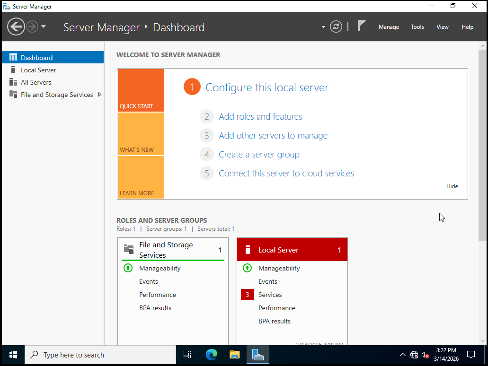
*Figure 1: Windows Server 2022 successfully installed on a KVM virtual machine. Initial server configuration performed through Server Manager prior to deploying Active Directory Domain Services.*


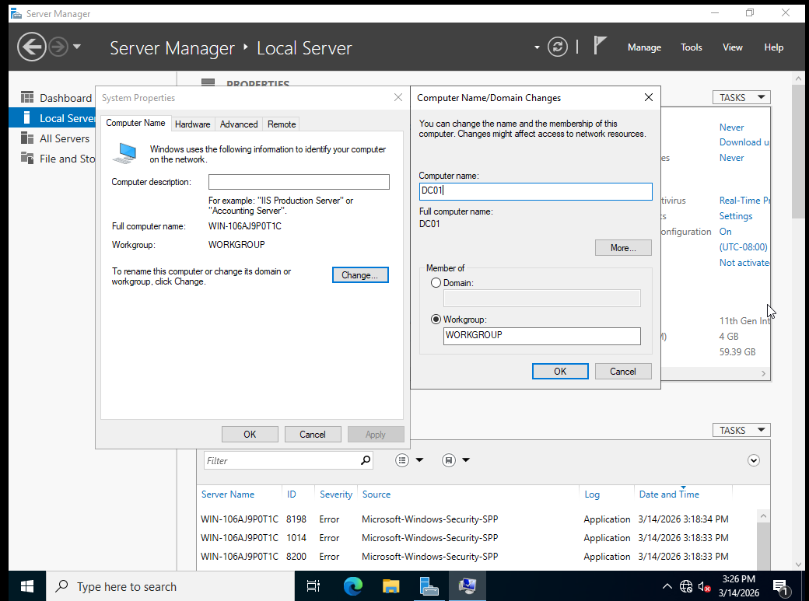
*Figure 2: Navigated to Server Manager → Local Server to rename the machine to DC01 prior to configuring Active Directory Domain Services.*


### Verifying Network Connectivity
--------------
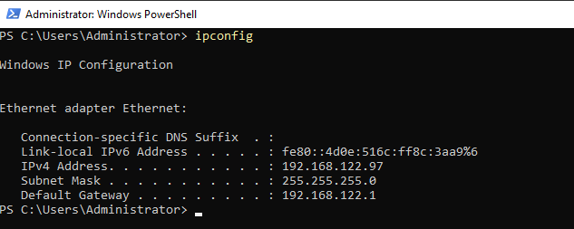

*Figure 3: Verified network connectivity on the Windows Server VM using ipconfig after configuring the virtual NIC in the KVM environment.*

### Setting Static IP, DNS Configuration
-------
Steps
``` 
- Open Control Panel
- Navigate to Network and Internet
- Click Network and Sharing Center
- Select Change adapter settings
- Right-click Ethernet
- Click Properties
- Select Internet Protocol Version 4 (TCP/IPv4)
- Click Properties
- Configure the following values:
- IP Address:      192.168.122.97
- Subnet Mask:     255.255.255.0
- Default Gateway: 192.168.122.1
- Preferred DNS:   192.168.122.97
```

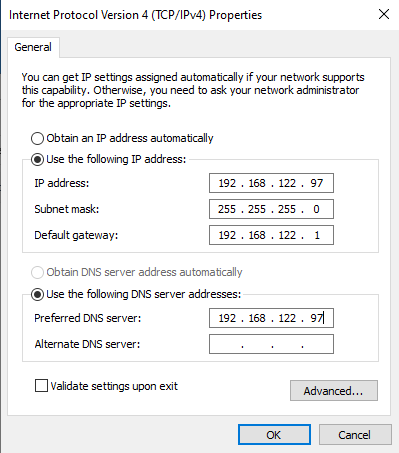

*Figure 4: Set Static IP, DNS Configuration -> Configure Static IP for the Domain Controller*

Click OK to apply the configuration.

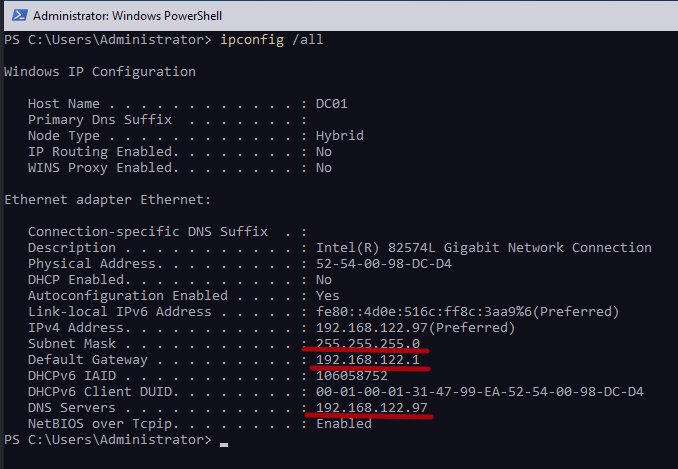

*Figure 5: Verify the configuration settings*


### Installing Active Directory Domain Services
--------
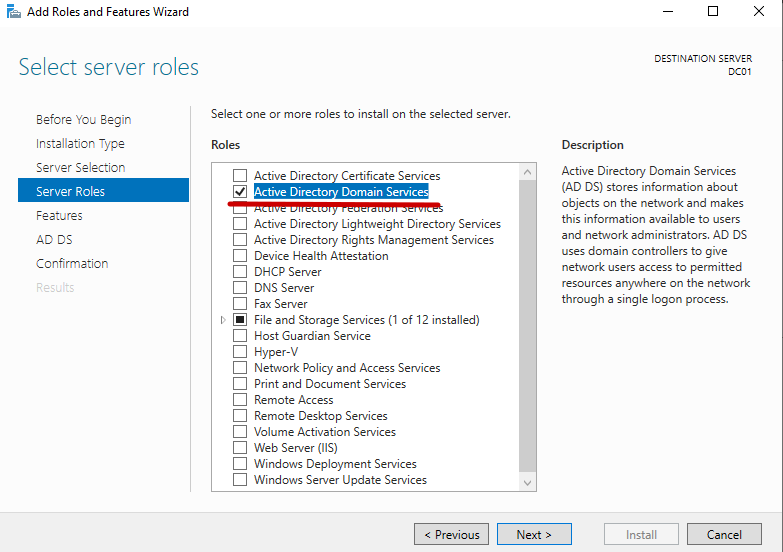

*Figure 6: Installed the Active Directory Domain Services (AD DS) role. AD DS provides centralized identity and access management by storing users, computers, and security groups in a directory and enabling authentication through domain controllers.*

Steps
```
- Open Server Manager from the Windows Server dashboard.
- Click Manage in the top-right corner.
- Select Add Roles and Features.
- On the Before You Begin page, click Next.
- On Installation Type, select Role-based or feature-based installation, then click Next.
- On Server Selection, confirm the server DC01 is selected, then click Next.
- On Server Roles, check Active Directory Domain Services.
- When prompted to install additional required features, click Add Features.
- Click Next through the Features page without making changes.
- Review the Active Directory Domain Services information page and click Next.
- Click Install to begin installing the AD DS role.
```

### Promoting the Domain Controller
-----
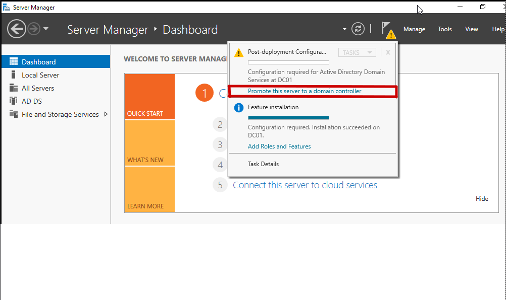

*Figure 7: Promoting the server to a domain controller*

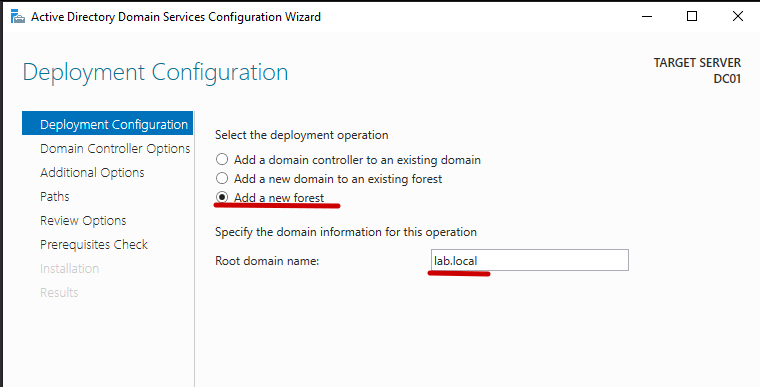

*Figure 8: Creating a new Active Directory Forest*


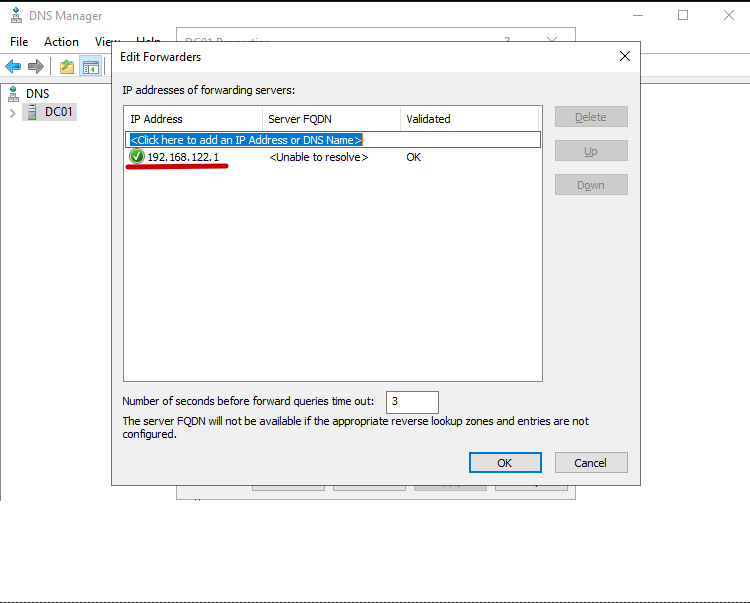

*Figure 9: Configured a DNS forwarder on the domain controller to allow external DNS resolution. The domain controller resolves internal Active Directory records locally while forwarding external queries to the upstream network gateway.*


Steps
```
- Open Server Manager.
- Click Tools in the top-right menu.
- Select DNS to open the DNS Manager.
- In the left navigation pane, right-click the server:
- DC01
- Click Properties.
- Navigate to the Forwarders tab.
- Click Edit.
- Add the upstream gateway address: 192.168.122.1
- Click OK, then Apply, then OK.
- Verify DNS Forwarding
- Open PowerShell on the domain controller and run:
`nslookup google.com`
```

Example output:

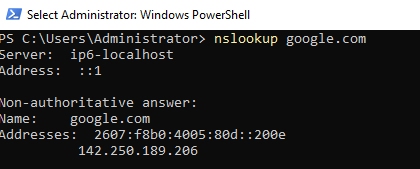

*Figure 10: The returned IP addresses confirm that the DNS server successfully forwarded the query and received a response from an external DNS server.*


### Creating Organizational Units (OU Structure)
------------
#### Overview
To organize identity objects within the Active Directory domain, Organizational Units (OUs) were created. OUs provide a logical structure for managing users, groups, and computers while enabling administrators to apply Group Policy and delegate administrative control. Establishing a structured directory hierarchy is a foundational step in enterprise Identity and Access Management (IAM) environments.

In this lab, two primary OUs were created to separate user accounts from security groups. This structure supports future implementation of Role-Based Access Control (RBAC), policy enforcement through Group Policy Objects (GPOs), and organized identity lifecycle management.

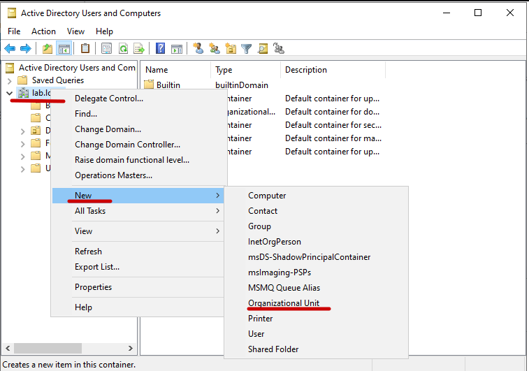

*Figure 11: Creating Organizational Units*

Steps: Creating Organizational Units
```
- Open Server Manager.
- Select Tools from the top-right menu.
- Click Active Directory Users and Computers.
- In the left panel, expand the domain: lab.local
- Right-click the domain name. Select: New → Organizational Unit
- Enter the name: UserAccounts
- Leave Protect container from accidental deletion enabled.
- Repeat the process to create another OU called "Groups"
```

The following OUs were created within the domain:
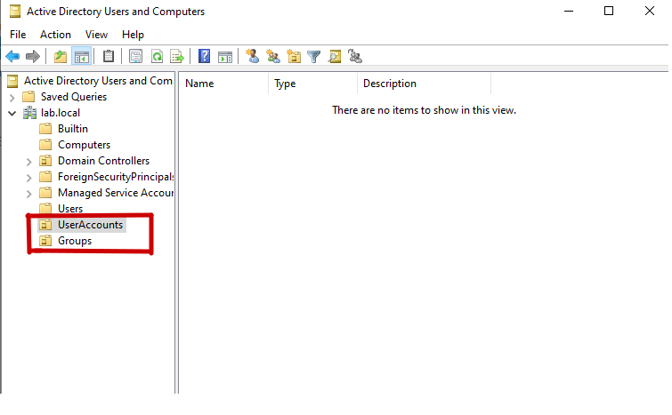

*Figure 12: Organizational Units Created within the Domain. UserAccounts will store user objects organized by department. Groups will store security groups used for role-based access control.*

### Creating Security Groups
------------------
Security groups were created inside the Groups Organizational Unit to represent organizational roles.

Steps
```
- Open Server Manager.
- Click Tools → Active Directory Users and Computers.
- Expand the domain: lab.local
- Select the Groups Organizational Unit.
- Right-click inside the Groups OU.
- Select: New → Group
- Enter the group name.
- Example groups created in this lab:
- IT_Admins
- HelpDesk
- Finance_Team
```

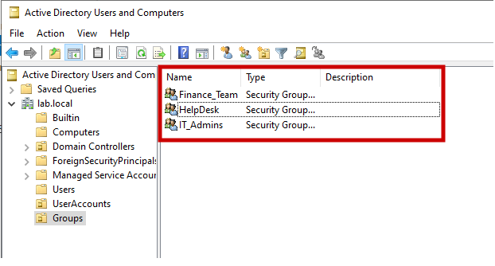

*Figure 13: Security groups (Finance_Team, HelpDesk, and IT_Admins) created in Active Directory to represent departmental roles and support role-based access control (RBAC).*

Ensure the following settings are selected:
- Group scope: Global
- Group type: Security
These groups will later be used to assign permissions and enforce role-based access policies.


### Creating User Accounts
----------
User accounts were created inside the UserAccounts Organizational Unit to represent individual identities within the directory.

Steps
```
- In Active Directory Users and Computers, expand the domain: lab.local
- Select the UserAccounts Organizational Unit.
- Right-click inside the OU.
- Select: New → User
- Enter the user details.
- Example users created in this lab:
- Alex Gonzalez
- John Doe
- Nate Smith
```

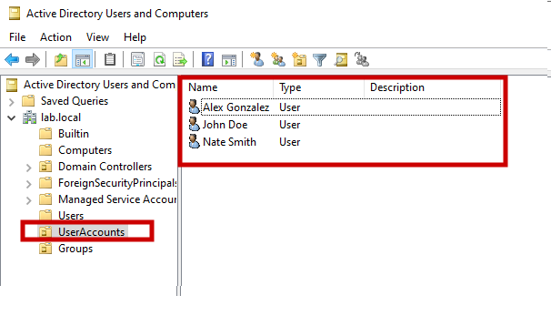

*Figure 14: Domain user accounts created within the UserAccounts Organizational Unit to represent individual identities managed by Active Directory.*

Assign a password.
Configure password options as needed (for example, disabling the forced password change for lab users).

Click Finish to create the account.
These accounts simulate domain identities that will authenticate against the domain controller.

### Assigning Users to Security Groups
--------------
Users were then assigned to the appropriate security groups to implement role-based access control.

Steps
```
- In Active Directory Users and Computers, navigate to the UserAccounts OU.
- Right-click the desired user account.
- Select: Add to a group
- Enter the name of the security group.
- Example: IT_Admins
- Click Check Names to validate the group.
- Verifying Group Membership
- To confirm that the user was successfully added to the security group:
- Navigate to the Groups OU.
- Right-click the desired group (e.g., IT_Admins).
- Select Properties.
- Open the Members tab.
- Confirm that the user appears in the membership list.
```

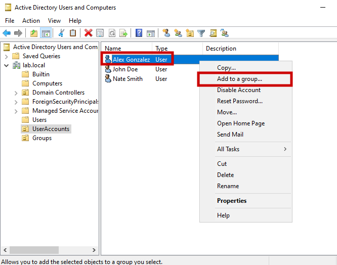

*Figure 15: A domain user (Alex Gonzalez) being added to a security group through the Add to a group option in Active Directory Users and Computers.*

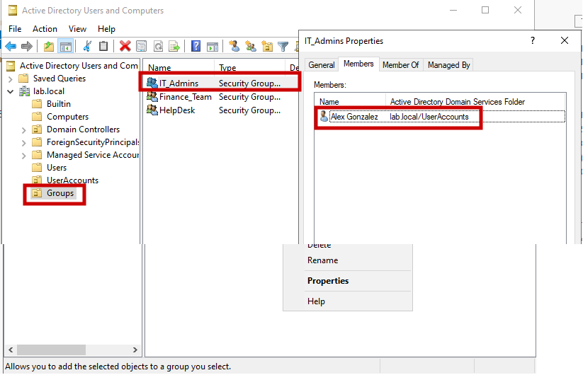

*Figure 16: Verification of group membership showing Alex Gonzalez assigned to the IT_Admins security group, demonstrating role-based access control through group membership.*

### Automating User Account Provisioning
----------
The following script provisions five user accounts and automatically assigns them to the IT_Admins security group.

```
$password = ConvertTo-SecureString "LabPassword123!" -AsPlainText -Force

for ($i=1; $i -le 5; $i++) {

    $username = "ITUser$i"

    New-ADUser `
        -Name $username `
        -SamAccountName $username `
        -UserPrincipalName "$username@lab.local" `
        -AccountPassword $password `
        -Enabled $true `
        -Path "OU=UserAccounts,DC=lab,DC=local"

    Add-ADGroupMember -Identity "IT_Admins" -Members $username
}
```

This script performs the following actions:
```
- Imports the Active Directory PowerShell module
- Defines a default password for the provisioned accounts
- Creates five new user accounts
- Places the users within the UserAccounts Organizational Unit
- Adds each user to the IT_Admins security group
```

### Verifying User Creation
--------------
User creation and group membership can be verified using PowerShell.
```Get-ADGroupMember IT_Admins```

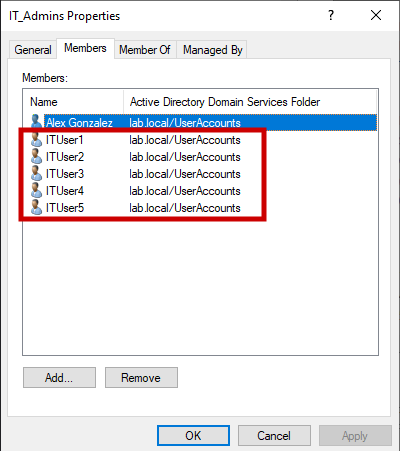

*Figure 17: Verification of the IT_Admins security group membership in Active Directory, showing domain users assigned to the group through both manual and automated provisioning.*


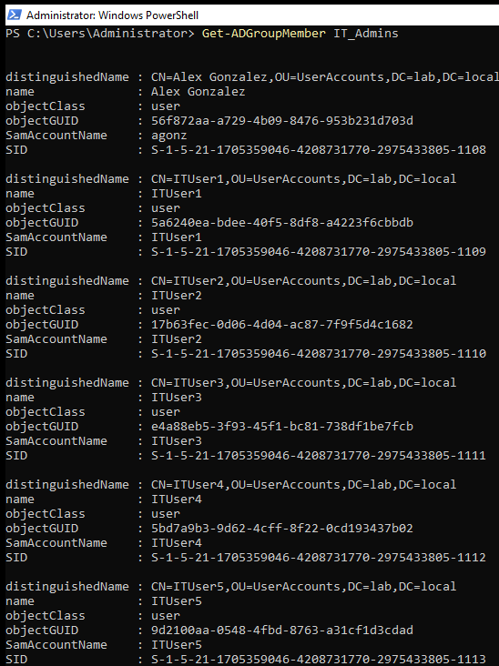

*Figure 18: Verifying Active Directory group membership using PowerShell with Get-ADGroupMember IT_Admins, displaying users assigned to the IT_Admins security group.*

### Enforcing Domain Password and Account Lockout Policies with Group Policy
-------------
Group Policy allows administrators to centrally enforce security settings across an Active Directory domain. Instead of configuring authentication rules on individual machines, policies are defined once in a Group Policy Object (GPO) and applied domain-wide.

In this lab, the Default Domain Policy was modified to enforce password complexity requirements and account lockout protections, helping mitigate brute force and password spraying attacks.

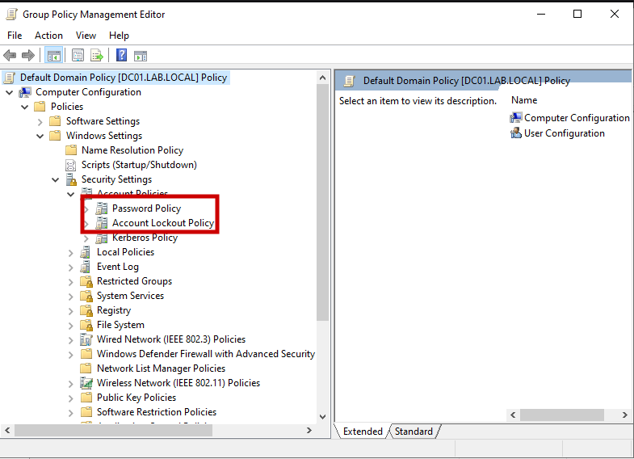

*Figure 18: Navigating to Password Policy and Account Lockout Policy within the Default Domain Policy using the Group Policy Management Editor.*

### Configuring Password Policy
-------------------
Password policies were configured within the Default Domain Policy to enforce stronger authentication standards across the domain.

Navigation path:
```
Group Policy Management
→ Forest
→ Domains
→ lab.local
→ Default Domain Policy
→ Edit
→ Computer Configuration
→ Policies
→ Windows Settings
→ Security Settings
→ Account Policies
→ Password Policy / Account Lockout
```

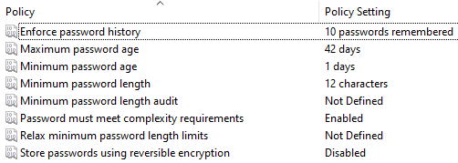

*Figure 19: Password policy settings configured to enforce minimum password length, password history, and complexity requirements across the Active Directory domain.*

### Applying the Policy
------------
After modifying the policy, the updated Group Policy configuration was applied immediately using PowerShell.

Command used:
`gpupdate /force`

This command forces the system to refresh both computer and user policies.

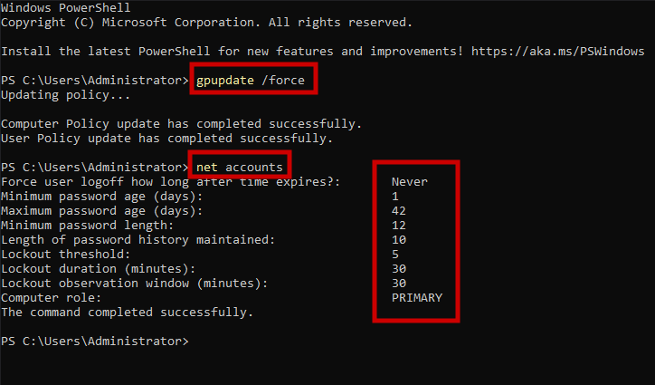

*Figure 20: Applying updated Group Policy settings with gpupdate /force and verifying domain password and lockout policies using the net accounts command in PowerShell.*

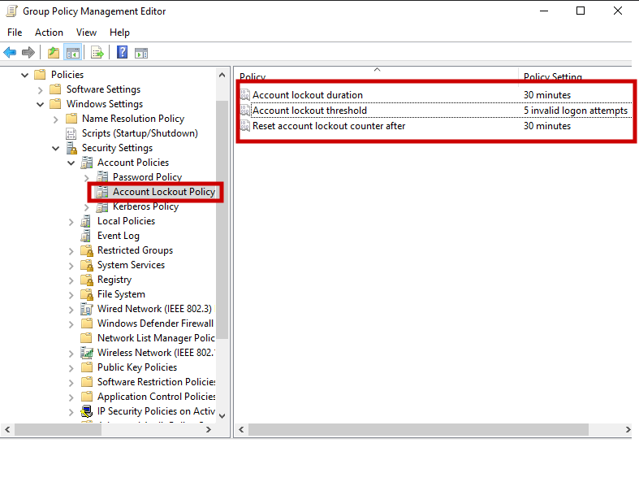

*Figure 21: Configuring Account Lockout Policy in the Default Domain Policy to lock accounts after 5 failed login attempts and automatically reset the lockout counter after 30 minutes.*

**Verifying Policy Enforcement**
Policy enforcement can be verified from the domain controller using the following command:

`net accounts`

This command displays the currently enforced domain authentication settings, including password length requirements, password history, and account lockout thresholds. Successful verification confirms that the Group Policy configuration is being enforced across the domain environment.

### Implementing Role-Based Access Control (RBAC) with Shared Resources
--------------------
To demonstrate how Active Directory groups control access to resources, departmental shared folders were created and permissions were assigned to the corresponding security groups. Rather than granting access to individual users, permissions were applied to groups, allowing users to inherit access through group membership. This follows the Role-Based Access Control (RBAC) model commonly used in enterprise environments.

In this lab, three departmental shares were created and mapped to their respective Active Directory security groups.

Example mapping:
```
Finance_Share  → Finance_Team
IT_Share       → IT_Admins
HelpDesk_Share → HelpDesk
```

This ensures that only members of each group can access their designated resources.

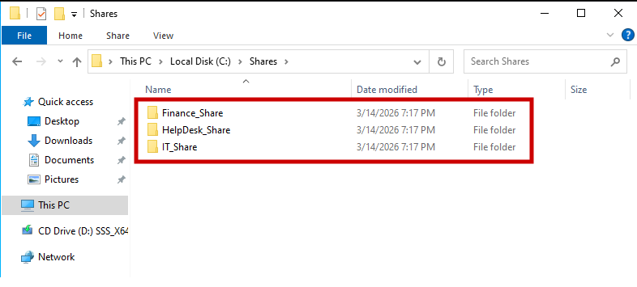

*Figure 22: Departmental shared folders (Finance_Share, HelpDesk_Share, and IT_Share) created on the server to demonstrate role-based access control (RBAC) using Active Directory security groups.*


### Assigning NTFS Permissions
---------------
Permissions were configured so that each department group has access only to its corresponding folder.
Steps:
```
- Navigate to the folder location: C:\Shares
- Right-click the folder (example: Finance_Share) and select: Properties
- Go to the Security tab.
- Click: Edit → Add
- Enter the Active Directory group name.
- Example: Finance_Team
- Click: Check Names → OK
- Assign the appropriate permissions (example: Modify or Read/Write).
- Click Apply → OK.
```

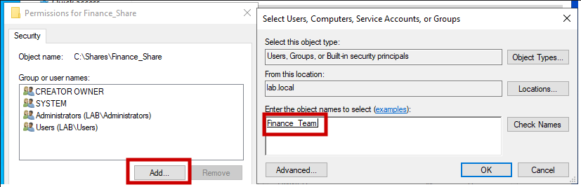

*Figure 23: Assigning NTFS permissions to the Finance_Team Active Directory security group for the Finance_Share folder to enforce role-based access control.*

This process was repeated for all three departmental folders using their corresponding security groups.

### Configuring Network Sharing
----------------
To allow users to access these folders over the network, each directory was configured as a shared resource.

Steps:
```
Right-click the folder and select: Properties
Open the Sharing tab.
Click: Advanced Sharing
Enable: Share this folder
Click: Permissions
Add the corresponding Active Directory group (example: IT_Admins).
Assign appropriate share permissions (example: Read or Change).
Click Apply → OK.
```

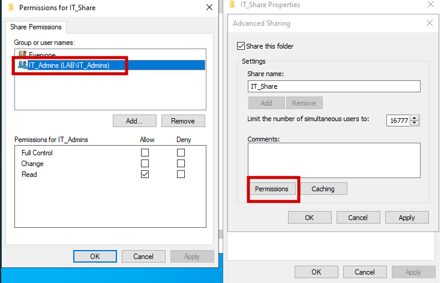

*Figure 24: Configuring network share permissions for IT_Share and granting access to the IT_Admins Active Directory security group through Advanced Sharing settings.*

Although the screenshots demonstrate the configuration for one group, the same process was applied to all three departmental shares.


### Conclusion
-------------
This lab demonstrates the foundational architecture of an Active Directory environment and how centralized identity management is implemented in enterprise networks. By deploying a domain controller, organizing directory objects with Organizational Units, enforcing authentication policies with Group Policy, and controlling resource access through security groups, the environment models the core principles of enterprise identity and access management.

The lab also highlights how administrative tasks such as user provisioning can be automated with PowerShell, reflecting real-world operational practices used to manage large-scale directory environments. Together, these components illustrate how Active Directory provides centralized authentication, authorization, and policy enforcement across a domain infrastructure.
